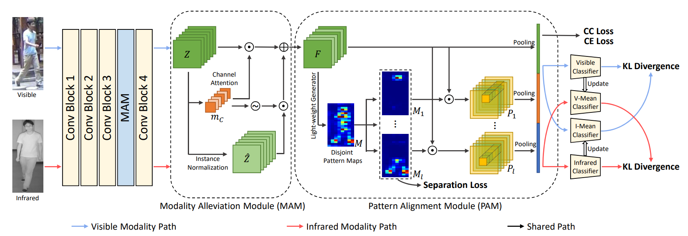

# Discover Cross-Modality Nuances for Visible-Infrared Person Re-Identification 
[\[paper\]](https://openaccess.thecvf.com/content/CVPR2021/papers/Wu_Discover_Cross-Modality_Nuances_for_Visible-Infrared_Person_Re-Identification_CVPR_2021_paper.pdf)

This repository is Pytorch code for our proposed joint Modality and Pattern Alignment Network (MPANet)



## Environmental requirements:

PyTorch == 1.2.0

ignite == 0.2.1

torchvision == 0.4.0

apex == 0.1

## Quick start

1. Clone this repository:

```shell
git clone https://github.com/MPANet/MPANet.git
```

2. Modify the path to datasets:

The path to datasets can be modified in the following file:

```shell
./configs/default/dataset.py
```

3. Training:

To train the model, you can use following command:

SYSU-MM01:
```Shell
python train.py --cfg ./configs/SYSU.yml
```

RegDB:
```Shell
python train.py --cfg ./configs/RegDB.yml
```

## trained model:
The checkpoint can be found here:
https://pan.baidu.com/s/1TnjtfMFPnm5TEprgAhqz9A 

Code: rfti
